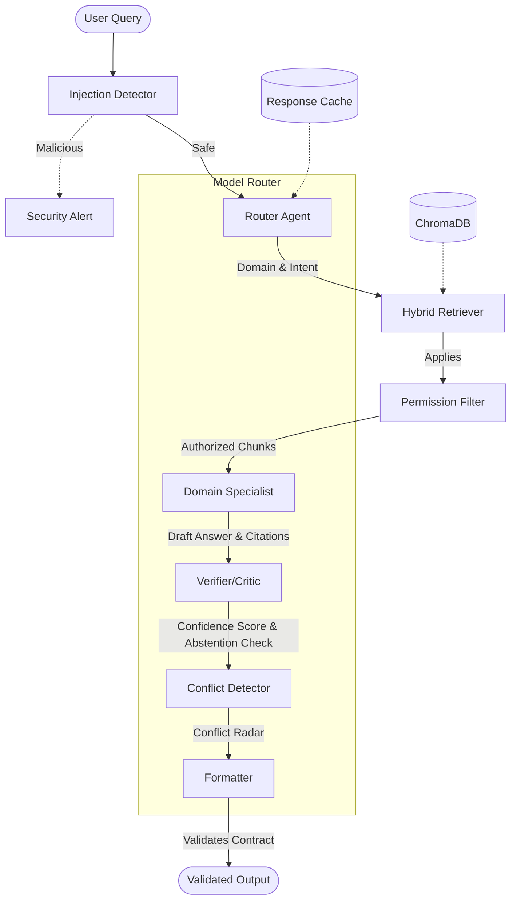

# KOHLER CONCORD — Unified Enterprise AI Agent

**KOHLER CONCORD** is an enterprise-grade conversational AI agent equipped with a **Trust Layer** for answering complex queries across HR, Finance, Customer Support, Privacy, and Legal domains. It was built for the KOHLER-MITWPU AI Research Lab Case Study, Track 3.

[](https://youtu.be/bD0n76-pJVc)

## Key Innovations (The 5 Trust Layer Features)

1. **Role & Permission-Aware Retrieval:** Persona-based access controls ensure users only retrieve documents they are authorized to see (e.g., Finance Analyst vs. Employee).
2. **Policy Conflict Radar:** Detects and flags contradictions across different domain policies (e.g., HR expense limits vs. Finance caps).
3. **Self-Verifying Multi-Agent Pipeline:** Features a Critic/Verifier agent that double-checks citations, calculates confidence scores, and determines if the agent should abstain from answering.
4. **Output Contracts with Validation:** Enforces structured outputs (JSON, XML, Excel, formatted Emails) and validates them before presenting to the user.
5. **Built-in Evaluation & Red-Team Dashboard:** Integrated evaluation suite measuring faithfulness, pass rate, data leakage, and system resilience against injection attacks. 
*(Plus: A live Sustainability/Efficiency Counter tracking tokens and estimated energy savings.)*

## Architecture



## Quick Start

```bash
# Clone and setup
git clone <repo>
cd kohler-concord
pip install -r requirements.txt

# Configure
cp .env.example .env
# Edit .env with your LLM API key

# Run the app
streamlit run app.py
```

## Login & Authentication

When the app starts, a **login page** is shown before any data or features are accessible.

- **Internal roles** (Employee, HR Manager, Finance Analyst, Legal Counsel) require a shared password.
- **Customer** role can enter without a password ("Continue as Customer").
- The password is read from `APP_PASSWORD` in your `.env` file (default: `kohler2024`).
- Once logged in, the selected role is **locked for the session** — all permission-aware retrieval and access rules use that role.
- A **Logout** button in the sidebar clears the session and returns to the login page.

To change the password, edit your `.env` file:
```
APP_PASSWORD=your-new-password
```

## Testing & Evaluation

- Run tests: `python -m pytest tests/ -v`
- Run evaluation: `python -m eval.runner` (or use the Eval Dashboard button in the UI)

## Tech Stack

| Component | Technology |
| --- | --- |
| Runtime | Python 3.11+ |
| UI | Streamlit |
| Vector DB | ChromaDB |
| LLM | OpenAI API / Any OpenAI-compatible Provider |
| Embeddings | sentence-transformers (local) |
| Output Parsing | openpyxl, lxml, jsonschema |

## Project Structure

```text
kohler-concord/
├── src/
│   ├── config.py
│   ├── llm.py
│   ├── ...
├── eval/
├── tests/
├── data/
│   └── knowledge_base/
├── README.md
├── PROMPTS.md
├── run.bat
├── run.sh
└── app.py
```

## Design Decisions

* **Why ChromaDB:** Runs locally without extra infrastructure, supports excellent metadata filtering essential for our Role & Permission-Aware Retrieval.
* **Why Hybrid Retrieval:** Semantic search catches the meaning and intent, while BM25 (keyword search) catches exact terms and clause IDs.
* **Why Multi-Agent over Monolithic:** Separation of concerns improves reliability, verifiability, and debuggability. A verifier agent can catch mistakes made by the specialist.
* **Why Hardcoded + LLM Conflict Detection:** A hybrid approach ensures reliable detection of known conflict patterns while retaining the LLM's capability for zero-shot discovery of novel contradictions.
* **Why Local Embeddings:** No extra API costs and supports fully offline document processing.

## Data

The knowledge base consists of entirely **synthetic** data created for this case study. It includes artificially injected edge cases and exactly 3 intentional cross-domain policy conflicts designed to trigger the Conflict Radar feature.

## License

MIT

## Streaming Answer Display

CONCORD streams verified answers word-by-word for a polished UX, similar to ChatGPT. While the backend pipeline runs (routing, retrieval, verification), a live status indicator shows each step. Once verification completes, the final answer streams smoothly to the user.

- Structured outputs (JSON, XML, Email, Excel) are **not** streamed—they display as validated blocks with download buttons.
- If streaming fails for any reason, the full answer is shown instantly as a fallback.

## Feedback System

Every assistant answer includes 👍 / 👎 feedback buttons, building the foundation for a **Continuous Improvement / RLHF loop**.

- Feedback is saved to `feedback/feedback_log.jsonl` with: timestamp, role, question, answer, confidence, cited clauses, domains, and optional user comment.
- Thumbs-down prompts an optional "What went wrong?" text box.
- The **Eval Dashboard** tab includes a **Feedback Summary** showing total ratings, thumbs up/down counts, and satisfaction percentage.
- The `feedback/` directory is in `.gitignore` to protect real user data; a sample file is included for demos.
